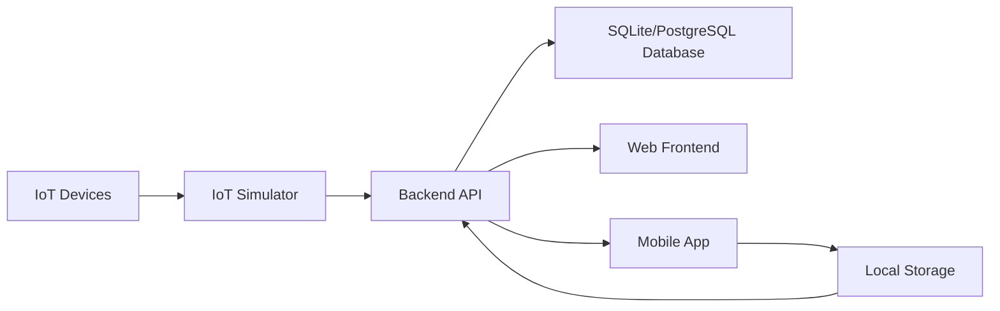

# Cogtive Industrial IoT Platform Documentation

## Overview

The Cogtive Industrial IoT Platform is a comprehensive solution for factory floor operations, providing real-time monitoring, data collection, and analysis capabilities. This documentation covers the implementation details, architecture, and setup instructions for the platform.

## Architecture

### System Components

1. **Backend API (.NET Core)**
   - RESTful API for data management
   - Entity Framework Core for data access
   - SQLite database (default)
   - PostgreSQL database (optional)
   - Real-time data processing

2. **Frontend Web Application (React)**
   - Modern, responsive UI
   - Real-time data visualization
   - Advanced filtering and sorting
   - Error handling and loading states
   - Search functionality
   - Status-based filtering

3. **Mobile Application (Xamarin.Forms)**
   - Factory floor operations interface
   - Offline data collection
   - QR code scanning capability
   - Data synchronization
   - Local storage for offline mode
   - Error handling and user feedback

4. **IoT Simulator**
   - Simulates industrial machine data
   - Configurable data generation
   - Real-time data streaming
   - Error simulation capabilities
   - Multiple machine support

### Data Flow



## Implementation Details

### Backend Implementation

1. **Data Models**
   ```csharp
   public class Machine
   {
       public int Id { get; set; }
       public string Name { get; set; }
       public string SerialNumber { get; set; }
       public string Type { get; set; }
       public bool IsActive { get; set; }
   }

   public class ProductionData
   {
       public int Id { get; set; }
       public int MachineId { get; set; }
       public DateTime Timestamp { get; set; }
       public decimal Efficiency { get; set; }
       public int UnitsProduced { get; set; }
       public int Downtime { get; set; }
   }
   ```

2. **Database Configuration**
   - SQLite (default)
   - PostgreSQL (optional)
   - Entity Framework Core migrations
   - Proper indexing on MachineId

3. **API Endpoints**
   - GET `/api/machines` - List all machines
   - GET `/api/machines/{id}` - Get machine details
   - GET `/api/machines/{id}/production-data` - Get machine production data
   - GET `/api/production-data` - List all production data
   - POST `/api/production-data` - Add new production data

### Frontend Implementation

1. **Features**
   - Machine listing with filtering and sorting
   - Real-time production data visualization
   - Search functionality
   - Status-based filtering
   - Error handling and loading states
   - Responsive design

2. **State Management**
   - React hooks for state management
   - Proper error handling
   - Loading states
   - Data caching

3. **UI Components**
   - Machine list with sorting and filtering
   - Production data visualization
   - Search input
   - Status filters
   - Error messages
   - Loading indicators

### Mobile Implementation

1. **Features**
   - Offline-first approach
   - Data synchronization
   - QR code scanning
   - Production data entry
   - Error handling
   - User feedback

2. **Offline Support**
   - Local storage for offline data
   - Automatic synchronization
   - Conflict resolution
   - Network status monitoring

3. **UI Components**
   - Machine selection
   - Production data entry form
   - QR code scanner
   - Sync status indicator
   - Error messages
   - Loading indicators

### Implementação Mobile (.NET MAUI)

1. **Visão Geral do .NET MAUI**
   - Framework multiplataforma da Microsoft
   - Suporte nativo para Windows, Android, iOS e macOS
   - Interface de usuário declarativa usando XAML
   - Acesso a recursos nativos de cada plataforma

2. **Estrutura do Projeto**
   ```
   mobile/
   ├── Platforms/           # Implementações específicas por plataforma
   ├── Resources/           # Recursos (imagens, fontes, etc.)
   ├── Models/             # Modelos de dados
   ├── Services/           # Serviços e lógica de negócios
   ├── App.xaml            # Definição do aplicativo
   ├── MainPage.xaml       # Página principal
   └── MauiProgram.cs      # Configuração do aplicativo
   ```

3. **Componentes Principais**
   - **Interface do Usuário**
     - Seleção de máquinas via Picker
     - Exibição de status em tempo real
     - Formulário de entrada de dados
     - Scanner de QR Code
     - Indicadores de sincronização

   - **Funcionalidades**
     - Modo offline com armazenamento local
     - Sincronização de dados
     - Escaneamento de QR Code
     - Coleta de dados de produção
     - Tratamento de erros
     - Feedback ao usuário

4. **Recursos Técnicos**
   - **Armazenamento Local**
     - SQLite para dados offline
     - Cache de configurações
     - Gerenciamento de estado

   - **Comunicação**
     - REST API integration
     - WebSockets para dados em tempo real
     - Tratamento de conexão offline

   - **UI/UX**
     - Design responsivo
     - Temas e estilos personalizados
     - Animações e transições
     - Suporte a gestos

5. **Boas Práticas**
   - Arquitetura MVVM (Model-View-ViewModel)
   - Injeção de dependência
   - Gerenciamento de estado
   - Tratamento de erros
   - Testes unitários
   - Performance optimization

6. **Requisitos do Sistema**
   - Visual Studio 2022 ou posterior
   - .NET 6.0 SDK ou superior
   - Android SDK (para desenvolvimento Android)
   - Xcode (para desenvolvimento iOS/macOS)
   - Windows SDK (para desenvolvimento Windows)

7. **Configuração do Ambiente**
   ```bash
   # Instalação do .NET MAUI
   dotnet workload install maui

   # Criação de um novo projeto
   dotnet new maui -n MeuApp

   # Execução do aplicativo
   dotnet build -t:Run -f net6.0-android
   ```

8. **Considerações de Desenvolvimento**
   - Testar em múltiplas plataformas
   - Otimizar recursos para diferentes tamanhos de tela
   - Implementar feedback visual para ações do usuário
   - Manter consistência com as diretrizes de design de cada plataforma
   - Considerar limitações de conectividade
   - Implementar tratamento de erros robusto

### Implementação do Simulador IoT

1. **Visão Geral**
   - Simulador de dados industriais em tempo real
   - Geração automática de métricas de produção
   - Simulação de múltiplos dispositivos IoT
   - Integração com a API do sistema

2. **Configuração do Simulador**
   ```javascript
   // Configurações principais
   const API_ENDPOINT = 'http://localhost:5211/api/production-data';
   const SEND_INTERVAL_MS = 10000; // Intervalo de 10 segundos
   
   // Máquinas simuladas
   const MACHINES = [
       { id: 1, name: 'CNC Machine Alpha' },
       { id: 2, name: 'Injection Molder Beta' },
       { id: 3, name: 'Assembly Line Gamma' }
   ];
   ```

3. **Geração de Dados**
   ```javascript
   function generateProductionData(machineId) {
       // Eficiência: 70-100%
       const efficiency = parseFloat((70 + Math.random() * 30).toFixed(1));
       
       // Unidades produzidas: 100-600
       const unitsProduced = Math.floor(100 + Math.random() * 500);
       
       // Tempo de inatividade: 0-60 minutos
       const downtime = Math.floor(Math.random() * 60);
       
       return {
           machineId,
           timestamp: new Date().toISOString(),
           efficiency,
           unitsProduced,
           downtime
       };
   }
   ```

4. **Funcionalidades em Tempo Real**
   - Envio contínuo de dados a cada 10 segundos
   - Simulação de condições reais (70% de taxa de envio)
   - Feedback visual no console
   - Tratamento de erros de comunicação

5. **Como Executar**
   ```bash
   # Instalar dependências
   cd iot-simulator
   npm install

   # Iniciar o simulador
   node index.js
   ```

6. **Personalização**
   - **Ajustar Intervalo de Envio**
     ```javascript
     const SEND_INTERVAL_MS = 5000; // Mudar para 5 segundos
     ```
   
   - **Adicionar Novas Máquinas**
     ```javascript
     const MACHINES = [
         { id: 1, name: 'CNC Machine Alpha' },
         { id: 2, name: 'Injection Molder Beta' },
         { id: 3, name: 'Assembly Line Gamma' },
         { id: 4, name: 'Nova Máquina' }
     ];
     ```
   
   - **Modificar Ranges de Dados**
     ```javascript
     // Exemplo: Eficiência entre 80-100%
     const efficiency = parseFloat((80 + Math.random() * 20).toFixed(1));
     ```

7. **Monitoramento**
   - **Logs do Console**
     - ✅ Sucesso: `Data sent successfully for machine X`
     - ❌ Erro: `Error sending data for machine X`
   
   - **Verificação de Dados**
     - API: `http://localhost:5211/api/production-data`
     - Interface Web: `http://localhost:3000`

8. **Tratamento de Erros**
   - Captura de erros de comunicação
   - Registro de falhas no console
   - Continuação do funcionamento após falhas temporárias
   - Retry automático no próximo ciclo

9. **Considerações de Desenvolvimento**
   - Simulação realista de condições de fábrica
   - Variação natural nos dados
   - Tratamento de falhas de rede
   - Feedback visual para debugging

## Setup Instructions

### Prerequisites

- .NET SDK 6.0 or later
- Node.js 16 or later
- Visual Studio or VS Code
- (Optional) Docker & Docker Compose

### Environment Setup

1. **Clone the Repository**
   ```bash
   git clone https://github.com/your-username/cogtive-dev-assignment.git
   cd cogtive-dev-assignment
   ```

2. **Start the Application**
   ```bash
   # Windows
   scripts\start-app.bat

   # Unix/Mac/Linux
   ./scripts/start-app.sh
   ```

3. **Access the Applications**
   - Web Frontend: http://localhost:3000
   - API: http://localhost:5211
   - Mobile App: Open in Visual Studio

### Database Configuration

1. **SQLite (Default)**
   - No additional configuration needed
   - Data stored in `products.db`

2. **PostgreSQL (Optional)**
   - Set environment variable: `DATABASE_PROVIDER=Postgres`
   - Configure connection string in `appsettings.json`
   - Database will be automatically created and migrated

## Development Guidelines

### Code Structure

```
cogtive-dev-assignment/
├── backend/           # .NET Core API
├── web/              # React frontend
├── mobile/           # Xamarin.Forms app
├── iot-simulator/    # IoT device simulator
└── scripts/          # Utility scripts
```

### Best Practices

1. **Code Organization**
   - Follow SOLID principles
   - Use dependency injection
   - Implement proper error handling
   - Write unit tests

2. **Database**
   - Use migrations for schema changes
   - Implement proper indexing
   - Follow naming conventions
   - Use transactions when needed

3. **Frontend**
   - Component-based architecture
   - State management
   - Error boundaries
   - Loading states

4. **Mobile**
   - Offline-first approach
   - Data synchronization
   - Error handling
   - User feedback

## Troubleshooting

### Common Issues

1. **Database Connection**
   - Check connection strings
   - Verify database is running
   - Check network connectivity

2. **API Issues**
   - Check API logs
   - Verify environment variables
   - Check CORS configuration

3. **Frontend Issues**
   - Clear browser cache
   - Check console errors
   - Verify API connectivity

4. **Mobile Issues**
   - Check network connectivity
   - Verify API URL configuration
   - Check local storage permissions

### Logging

- Backend logs: Console output
- Frontend logs: Browser console
- Mobile logs: Visual Studio output
- Database logs: SQLite/PostgreSQL logs

## Future Improvements

1. **Architecture**
   - Microservices architecture
   - Event-driven design
   - Message queues
   - Caching layer

2. **Features**
   - Real-time analytics
   - Machine learning integration
   - Advanced reporting
   - Mobile app enhancements

3. **DevOps**
   - CI/CD pipeline
   - Automated testing
   - Monitoring and alerting
   - Infrastructure as code

## Contributing

1. Fork the repository
2. Create a feature branch
3. Commit your changes
4. Push to the branch
5. Create a pull request

## License

This project is licensed under the MIT License - see the LICENSE file for details. 