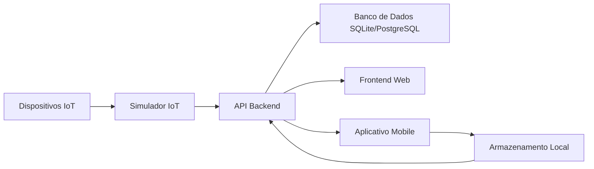

# Documentação da Plataforma IoT Industrial Cogtive

## Visão Geral

A Plataforma IoT Industrial Cogtive é uma solução abrangente para operações de chão de fábrica, fornecendo capacidades de monitoramento em tempo real, coleta de dados e análise. Esta documentação abrange os detalhes de implementação, arquitetura e instruções de configuração da plataforma.

## Arquitetura

### Componentes do Sistema

1. **API Backend (.NET Core)**
   - API RESTful para gerenciamento de dados
   - Entity Framework Core para acesso a dados
   - Banco de dados SQLite (padrão)
   - Banco de dados PostgreSQL (opcional)
   - Processamento de dados em tempo real

2. **Aplicação Web Frontend (React)**
   - Interface moderna e responsiva
   - Visualização de dados em tempo real
   - Filtragem e ordenação avançadas
   - Tratamento de erros e estados de carregamento
   - Funcionalidade de busca
   - Filtragem baseada em status

3. **Aplicação Mobile (.NET MAUI)**
   - Interface para operações de chão de fábrica
   - Coleta de dados offline
   - Capacidade de escaneamento de QR code
   - Sincronização de dados
   - Armazenamento local para modo offline
   - Tratamento de erros e feedback ao usuário

4. **Simulador IoT**
   - Simula dados de máquinas industriais
   - Geração de dados configurável
   - Streaming de dados em tempo real
   - Capacidades de simulação de erros
   - Suporte a múltiplas máquinas

### Fluxo de Dados



## Detalhes de Implementação

### Implementação do Backend

1. **Modelos de Dados**
   ```csharp
   public class Machine
   {
       public int Id { get; set; }
       public string Name { get; set; }
       public string SerialNumber { get; set; }
       public string Type { get; set; }
       public bool IsActive { get; set; }
   }

   public class ProductionData
   {
       public int Id { get; set; }
       public int MachineId { get; set; }
       public DateTime Timestamp { get; set; }
       public decimal Efficiency { get; set; }
       public int UnitsProduced { get; set; }
       public int Downtime { get; set; }
   }
   ```

2. **Configuração do Banco de Dados**
   - PostgreSQL como banco de dados principal
   - Configuração via variáveis de ambiente
   - Migrações do Entity Framework Core
   - Indexação otimizada para consultas frequentes
   - Conexão configurada para alta disponibilidade

   ```json
   // appsettings.json
   {
     "ConnectionStrings": {
       "PostgresConnection": "Host=postgres;Database=cogtive;Username=cogtive;Password=cogtive"
     },
     "DatabaseProvider": "Postgres"
   }
   ```

3. **Endpoints da API**
   - GET `/api/machines` - Listar todas as máquinas
   - GET `/api/machines/{id}` - Obter detalhes da máquina
   - GET `/api/machines/{id}/production-data` - Obter dados de produção da máquina
   - GET `/api/production-data` - Listar todos os dados de produção
   - POST `/api/production-data` - Adicionar novos dados de produção

### Implementação do Frontend

1. **Funcionalidades**
   - Listagem de máquinas com filtragem e ordenação
   - Visualização de dados de produção em tempo real
   - Funcionalidade de busca
   - Filtragem baseada em status
   - Tratamento de erros e estados de carregamento
   - Design responsivo

2. **Gerenciamento de Estado**
   - React hooks para gerenciamento de estado
   - Tratamento adequado de erros
   - Estados de carregamento
   - Cache de dados

3. **Componentes de UI**
   - Lista de máquinas com ordenação e filtragem
   - Visualização de dados de produção
   - Campo de busca
   - Filtros de status
   - Mensagens de erro
   - Indicadores de carregamento

4. **Atualizações em Tempo Real com WebSocket**
   ```typescript
   // Configuração do WebSocket
   const WS_BASE = process.env.REACT_APP_WS_BASE || 'ws://localhost:5000';
   
   // Hook personalizado para WebSocket
   const useWebSocket = (onDataUpdate: (data: ProductionData) => void) => {
     useEffect(() => {
       const ws = new WebSocket(`${WS_BASE}/ws/production-data`);
       
       ws.onmessage = (event) => {
         try {
           const data = JSON.parse(event.data) as ProductionData;
           onDataUpdate(data);
         } catch (error) {
           console.error('Erro ao processar dados do WebSocket:', error);
         }
       };
       
       ws.onerror = (error) => {
         console.error('Erro na conexão WebSocket:', error);
       };
       
       return () => {
         ws.close();
       };
     }, [onDataUpdate]);
   };
   ```

   **Implementação no Componente:**
   ```typescript
   const ProductionDashboard = () => {
     const [productionData, setProductionData] = useState<ProductionData[]>([]);
     
     const handleDataUpdate = useCallback((newData: ProductionData) => {
       setProductionData(prevData => {
         const updatedData = [...prevData];
         const index = updatedData.findIndex(d => 
           d.machineId === newData.machineId && 
           d.timestamp === newData.timestamp
         );
         
         if (index >= 0) {
           updatedData[index] = newData;
         } else {
           updatedData.push(newData);
         }
         
         return updatedData;
       });
     }, []);
     
     useWebSocket(handleDataUpdate);
     
     return (
       <div>
         {/* Renderização dos dados em tempo real */}
       </div>
     );
   };
   ```

   **Características da Implementação:**
   - Conexão WebSocket automática ao montar o componente
   - Reconexão automática em caso de falha
   - Atualização suave dos dados na interface
   - Tratamento de erros robusto
   - Limpeza adequada da conexão ao desmontar

   **Benefícios:**
   - Dados atualizados instantaneamente
   - Menor latência na atualização
   - Menor carga no servidor
   - Melhor experiência do usuário
   - Feedback visual imediato

   **Considerações de Implementação:**
   - Verificar suporte do navegador
   - Implementar fallback para navegadores sem suporte
   - Gerenciar reconexões em caso de perda de conexão
   - Otimizar performance com memoização
   - Implementar indicadores de status da conexão

### Implementação Mobile (.NET MAUI)

1. **Visão Geral do .NET MAUI**
   - Framework multiplataforma da Microsoft
   - Suporte nativo para Windows, Android, iOS e macOS
   - Interface de usuário declarativa usando XAML
   - Acesso a recursos nativos de cada plataforma

2. **Estrutura do Projeto**
   ```
   mobile/
   ├── Platforms/           # Implementações específicas por plataforma
   ├── Resources/           # Recursos (imagens, fontes, etc.)
   ├── Models/             # Modelos de dados
   ├── Services/           # Serviços e lógica de negócios
   ├── App.xaml            # Definição do aplicativo
   ├── MainPage.xaml       # Página principal
   └── MauiProgram.cs      # Configuração do aplicativo
   ```

3. **Componentes Principais**
   - **Interface do Usuário**
     - Seleção de máquinas via Picker
     - Exibição de status em tempo real
     - Formulário de entrada de dados
     - Scanner de QR Code
     - Indicadores de sincronização

   - **Funcionalidades**
     - Modo offline com armazenamento local
     - Sincronização de dados
     - Escaneamento de QR Code
     - Coleta de dados de produção
     - Tratamento de erros
     - Feedback ao usuário

4. **Recursos Técnicos**
   - **Armazenamento Local**
     - SQLite para dados offline
     - Cache de configurações
     - Gerenciamento de estado

   - **Comunicação**
     - Integração com API REST
     - WebSockets para dados em tempo real
     - Tratamento de conexão offline

   - **UI/UX**
     - Design responsivo
     - Temas e estilos personalizados
     - Animações e transições
     - Suporte a gestos

5. **Boas Práticas**
   - Arquitetura MVVM (Model-View-ViewModel)
   - Injeção de dependência
   - Gerenciamento de estado
   - Tratamento de erros
   - Testes unitários
   - Otimização de performance

6. **Requisitos do Sistema**
   - Visual Studio 2022 ou posterior
   - .NET 6.0 SDK ou superior
   - Android SDK (para desenvolvimento Android)
   - Xcode (para desenvolvimento iOS/macOS)
   - Windows SDK (para desenvolvimento Windows)

7. **Configuração do Ambiente**
   ```bash
   # Instalação do .NET MAUI
   dotnet workload install maui

   # Criação de um novo projeto
   dotnet new maui -n MeuApp

   # Execução do aplicativo
   dotnet build -t:Run -f net6.0-android
   ```

8. **Considerações de Desenvolvimento**
   - Testar em múltiplas plataformas
   - Otimizar recursos para diferentes tamanhos de tela
   - Implementar feedback visual para ações do usuário
   - Manter consistência com as diretrizes de design de cada plataforma
   - Considerar limitações de conectividade
   - Implementar tratamento de erros robusto

### Implementação do Simulador IoT

1. **Visão Geral**
   - Simulador de dados industriais em tempo real
   - Geração automática de métricas de produção
   - Simulação de múltiplos dispositivos IoT
   - Integração com a API do sistema

2. **Configuração do Simulador**
   ```javascript
   // Configurações principais
   const API_ENDPOINT = 'http://localhost:5000/api/production-data';
   const SEND_INTERVAL_MS = 10000; // Intervalo de 10 segundos
   const SUCCESS_RATE = 0.7; // Taxa de sucesso de 70%
   
   // Máquinas simuladas
   const MACHINES = [
       { id: 1, name: 'CNC Machine Alpha' },
       { id: 2, name: 'Injection Molder Beta' },
       { id: 3, name: 'Assembly Line Gamma' }
   ];
   ```

3. **Simulação de Condições Reais**
   O simulador implementa condições realistas de fábrica através de:

   a) **Taxa de Sucesso (70%)**
   ```javascript
   function shouldSendData() {
       return Math.random() < SUCCESS_RATE; // 70% de chance de sucesso
   }

   async function simulateDataSend() {
       if (shouldSendData()) {
           // Simula envio bem-sucedido
           await sendData();
       } else {
           // Simula falha de envio
           console.log('Falha simulada no envio de dados');
       }
   }
   ```
   - Simula falhas de comunicação reais
   - 70% de tentativas bem-sucedidas
   - 30% de falhas simuladas
   - Ajuda a testar resiliência do sistema

   b) **Variação nos Dados**
   ```javascript
   function generateProductionData(machineId) {
       // Eficiência: 70-100% com variação realista
       const baseEfficiency = 85; // Eficiência base
       const variation = Math.random() * 15; // Variação de até 15%
       const efficiency = parseFloat((baseEfficiency + variation).toFixed(1));
       
       // Unidades produzidas: variação baseada na eficiência
       const baseUnits = 300;
       const unitsProduced = Math.floor(baseUnits * (efficiency / 100));
       
       // Tempo de inatividade: inversamente proporcional à eficiência
       const downtime = Math.floor((100 - efficiency) * 0.6);
       
       return {
           machineId,
           timestamp: new Date().toISOString(),
           efficiency,
           unitsProduced,
           downtime
       };
   }
   ```
   - Dados correlacionados (eficiência afeta produção)
   - Variações realistas nos valores
   - Simulação de tendências de produção

   c) **Padrões de Falha**
   ```javascript
   const FAILURE_PATTERNS = {
       NETWORK_ERROR: 'Erro de rede',
       MACHINE_ERROR: 'Erro na máquina',
       SENSOR_ERROR: 'Erro no sensor'
   };

   function simulateFailure() {
       const failures = Object.values(FAILURE_PATTERNS);
       const randomFailure = failures[Math.floor(Math.random() * failures.length)];
       return randomFailure;
   }
   ```
   - Diferentes tipos de falhas
   - Erros de rede
   - Problemas de máquina
   - Falhas de sensor

4. **Como Executar**
   ```bash
   # Instalar dependências
   cd iot-simulator
   npm install

   # Iniciar o simulador
   node index.js
   ```

5. **Monitoramento**
   - **Logs do Console**
     - ✅ Sucesso: `Data sent successfully for machine X`
     - ❌ Erro: `Error sending data for machine X: [Tipo de Erro]`
     - 📊 Métricas: `Efficiency: X%, Units: Y, Downtime: Z min`
   
   - **Verificação de Dados**
     - API: `http://localhost:5211/api/production-data`
     - Interface Web: `http://localhost:3000`

6. **Personalização**
   - **Ajustar Taxa de Sucesso**
     ```javascript
     const SUCCESS_RATE = 0.8; // Aumentar para 80%
     ```
   
   - **Modificar Variações**
     ```javascript
     const EFFICIENCY_VARIATION = 20; // Aumentar variação
     const BASE_UNITS = 400; // Aumentar produção base
     ```

7. **Considerações de Desenvolvimento**
   - Simulação realista de condições de fábrica
   - Variação natural nos dados
   - Tratamento de falhas de rede
   - Feedback visual para debugging
   - Teste de resiliência do sistema

## Instruções de Configuração

### Pré-requisitos

- .NET SDK 6.0 ou superior
- Node.js 16 ou superior
- Visual Studio ou VS Code
- (Opcional) Docker & Docker Compose

### Configuração do Ambiente

1. **Clonar o Repositório**
   ```bash
   git clone https://github.com/seu-usuario/cogtive-dev-assignment.git
   cd cogtive-dev-assignment
   ```

2. **Iniciar a Aplicação**
   ```bash
   # Windows
   scripts\start-app.bat

   # Unix/Mac/Linux
   ./scripts/start-app.sh
   ```

3. **Acessar as Aplicações**
   - Frontend Web: http://localhost:3000
   - API: http://localhost:5211
   - Aplicativo Mobile: Abrir no Visual Studio

### Configuração do Banco de Dados

1. **SQLite (Padrão)**
   - Nenhuma configuração adicional necessária
   - Dados armazenados em `products.db`

2. **PostgreSQL (Opcional)**
   - Definir variável de ambiente: `DATABASE_PROVIDER=Postgres`
   - Configurar string de conexão em `appsettings.json`
   - O banco de dados será criado e migrado automaticamente

### Serviços Docker Compose

O projeto utiliza Docker Compose para orquestrar os seguintes serviços:

1. **Backend (.NET Core)**
   ```yaml
   backend:
     build: 
       context: ./backend
       dockerfile: Dockerfile
     ports:
       - "5000:5000"
     environment:
       - ASPNETCORE_ENVIRONMENT=Development
       - DatabaseProvider=Postgres
       - ConnectionStrings__PostgresConnection=Host=postgres;Database=cogtive;Username=cogtive;Password=cogtive
     volumes:
       - ./backend:/app
     depends_on:
       - postgres
     networks:
       - cogtive-network
   ```
   - API RESTful em .NET Core
   - Porta: 5000
   - Banco de dados PostgreSQL
   - Hot-reload para desenvolvimento

2. **Frontend (React)**
   ```yaml
   frontend:
     build:
       context: ./web
       dockerfile: Dockerfile
     ports:
       - "3000:3000"
     environment:
       - REACT_APP_API_BASE=http://localhost:5000
       - REACT_APP_WS_BASE=ws://localhost:5000
     volumes:
       - ./web:/app
       - /app/node_modules
     depends_on:
       - backend
     networks:
       - cogtive-network
   ```
   - Aplicação React
   - Porta: 3000
   - Hot-reload para desenvolvimento
   - Conectado ao backend

3. **Banco de Dados (PostgreSQL)**
   ```yaml
   postgres:
     image: postgres:latest
     ports:
       - "5432:5432"
     environment:
       - POSTGRES_DB=cogtive
       - POSTGRES_USER=cogtive
       - POSTGRES_PASSWORD=cogtive
     volumes:
       - postgres-data:/var/lib/postgresql/data
     networks:
       - cogtive-network
   ```
   - Banco de dados PostgreSQL
   - Porta: 5432
   - Volume persistente para dados
   - Configurável via variáveis de ambiente

4. **Rede Docker**
   ```yaml
   networks:
     cogtive-network:
       driver: bridge
   ```
   - Rede isolada para comunicação entre serviços
   - Bridge network para segurança

5. **Volumes**
   ```yaml
   volumes:
     postgres-data:
   ```
   - Volume persistente para dados do PostgreSQL
   - Preserva dados entre reinicializações

### Como Iniciar os Serviços

1. **Iniciar Todos os Serviços**
   ```bash
   docker-compose up
   ```

2. **Iniciar em Modo Detached**
   ```bash
   docker-compose up -d
   ```

3. **Iniciar Serviços Específicos**
   ```bash
   docker-compose up backend frontend
   ```

4. **Reconstruir e Iniciar**
   ```bash
   docker-compose up --build
   ```

### Verificando os Serviços

1. **Listar Serviços em Execução**
   ```bash
   docker-compose ps
   ```

2. **Ver Logs**
   ```bash
   # Todos os serviços
   docker-compose logs -f
   
   # Serviço específico
   docker-compose logs -f backend
   ```

3. **Acessar os Serviços**
   - Frontend: http://localhost:3000
   - Backend API: http://localhost:5000
   - PostgreSQL: localhost:5432

### Configuração do Ambiente

1. **Variáveis de Ambiente**
   - Criar arquivo `.env` na raiz do projeto
   - Configurar variáveis específicas do ambiente
   - Exemplo:
     ```env
     POSTGRES_PASSWORD=senha_segura
     ASPNETCORE_ENVIRONMENT=Development
     DatabaseProvider=Postgres
     ConnectionStrings__PostgresConnection=Host=postgres;Database=cogtive;Username=cogtive;Password=senha_segura
     ```

2. **Portas**
   - Backend: 5000
   - Frontend: 3000
   - PostgreSQL: 5432
   - WebSocket: 5000 (mesmo do backend)

3. **Volumes**
   - Código fonte montado para hot-reload
   - Dados do PostgreSQL persistentes
   - Node modules isolados

### Solução de Problemas

1. **Problemas de Conexão**
   - Verificar se todos os serviços estão rodando
   - Confirmar configurações de rede
   - Verificar logs de cada serviço

2. **Problemas de Build**
   - Limpar cache: `docker-compose build --no-cache`
   - Verificar Dockerfiles
   - Confirmar dependências

3. **Problemas de Volume**
   - Verificar permissões
   - Limpar volumes se necessário
   - Confirmar montagens

4. **Problemas de Porta**
   - Verificar portas em uso
   - Alterar mapeamento se necessário
   - Confirmar firewall

## Diretrizes de Desenvolvimento

### Estrutura do Código

```
cogtive-dev-assignment/
├── backend/           # API .NET Core
├── web/              # Frontend React
├── mobile/           # Aplicativo .NET MAUI
├── iot-simulator/    # Simulador de dispositivos IoT
└── scripts/          # Scripts utilitários
```

### Boas Práticas

1. **Organização do Código**
   - Seguir princípios SOLID
   - Usar injeção de dependência
   - Implementar tratamento adequado de erros
   - Escrever testes unitários

2. **Banco de Dados**
   - Usar migrações para alterações de esquema
   - Implementar indexação adequada
   - Seguir convenções de nomenclatura
   - Usar transações quando necessário

3. **Frontend**
   - Arquitetura baseada em componentes
   - Gerenciamento de estado
   - Limites de erro
   - Estados de carregamento

4. **Mobile**
   - Abordagem offline-first
   - Sincronização de dados
   - Tratamento de erros
   - Feedback ao usuário

## Solução de Problemas

### Problemas Comuns

1. **Conexão com Banco de Dados**
   - Verificar strings de conexão
   - Verificar se o banco de dados está rodando
   - Verificar conectividade de rede

2. **Problemas com API**
   - Verificar logs da API
   - Verificar variáveis de ambiente
   - Verificar configuração CORS

3. **Problemas com Frontend**
   - Limpar cache do navegador
   - Verificar erros no console
   - Verificar conectividade com API

4. **Problemas com Mobile**
   - Verificar conectividade de rede
   - Verificar configuração de URL da API
   - Verificar permissões de armazenamento local

### Logs

- Logs do Backend: Saída do console
- Logs do Frontend: Console do navegador
- Logs do Mobile: Saída do Visual Studio
- Logs do Banco de Dados: Logs SQLite/PostgreSQL

## Melhorias Futuras

1. **Arquitetura**
   - Arquitetura de microsserviços
   - Design orientado a eventos
   - Filas de mensagens
   - Camada de cache

2. **Funcionalidades**
   - Análise em tempo real
   - Integração com machine learning
   - Relatórios avançados
   - Melhorias no aplicativo mobile

3. **DevOps**
   - Pipeline CI/CD
   - Testes automatizados
   - Monitoramento e alertas
   - Infraestrutura como código

## Melhorias Recentes

### Refatoração com Extensões
O código foi refatorado para melhor organização e manutenibilidade usando o padrão de extensões do C#. As principais melhorias incluem:

#### WebSocketExtensions
- `HandleWebSocketConnection`: Gerencia a conexão WebSocket de forma encapsulada
- `GenerateProductionData`: Gera dados simulados de produção
- `SendProductionData`: Envia dados via WebSocket com logging integrado

#### ApplicationBuilderExtensions
- `ConfigureWebSocket`: Configuração centralizada do endpoint WebSocket
- `ConfigureDatabase`: Configuração flexível do banco de dados (SQLite/PostgreSQL)
- `ConfigureCors`: Configuração de políticas CORS

### Sistema de Logging Aprimorado
Implementamos um sistema de logging detalhado para monitoramento em tempo real:

#### Logs do WebSocket
- Conexão estabelecida/encerrada
- Dados enviados com detalhes completos:
  - ID da máquina
  - Eficiência
  - Unidades produzidas
  - Tempo de inatividade
- Erros e exceções
- Status da conexão

#### Como Visualizar os Logs
1. **No Docker:**
   ```bash
   docker logs -f <container_id>
   ```
   ou
   ```bash
   docker-compose logs -f backend
   ```

2. **No Console:**
   - Logs aparecem em tempo real durante a execução
   - Formato estruturado para fácil leitura
   - Informações detalhadas sobre o estado da aplicação

### Benefícios das Melhorias
1. **Código mais Organizado**
   - Separação clara de responsabilidades
   - Código mais fácil de manter
   - Melhor reutilização de componentes

2. **Melhor Monitoramento**
   - Logs detalhados em português
   - Rastreamento em tempo real
   - Facilidade para debug

3. **Maior Flexibilidade**
   - Configurações centralizadas
   - Fácil adaptação para diferentes ambientes
   - Suporte a múltiplos bancos de dados

4. **Manutenção Simplificada**
   - Código modular
   - Testes mais fáceis de implementar
   - Atualizações mais seguras

## Contribuindo

1. Faça um fork do repositório
2. Crie uma branch para sua feature
3. Faça commit das suas alterações
4. Faça push para a branch
5. Crie um Pull Request

## Licença

Este projeto está licenciado sob a Licença MIT - veja o arquivo LICENSE para detalhes. 