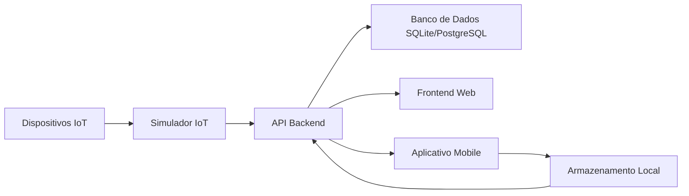

# Documentação da Plataforma IoT Industrial Cogtive

## Visão Geral

A Plataforma IoT Industrial Cogtive é uma solução abrangente para operações de chão de fábrica, fornecendo capacidades de monitoramento em tempo real, coleta de dados e análise. Esta documentação abrange os detalhes de implementação, arquitetura e instruções de configuração da plataforma.

## Arquitetura

### Componentes do Sistema

1. **API Backend (.NET Core)**
   - API RESTful para gerenciamento de dados
   - Entity Framework Core para acesso a dados
   - Banco de dados SQLite (padrão)
   - Banco de dados PostgreSQL (opcional)
   - Processamento de dados em tempo real

2. **Aplicação Web Frontend (React)**
   - Interface moderna e responsiva
   - Visualização de dados em tempo real
   - Filtragem e ordenação avançadas
   - Tratamento de erros e estados de carregamento
   - Funcionalidade de busca
   - Filtragem baseada em status

3. **Aplicação Mobile (.NET MAUI)**
   - Interface para operações de chão de fábrica
   - Coleta de dados offline
   - Capacidade de escaneamento de QR code
   - Sincronização de dados
   - Armazenamento local para modo offline
   - Tratamento de erros e feedback ao usuário

4. **Simulador IoT**
   - Simula dados de máquinas industriais
   - Geração de dados configurável
   - Streaming de dados em tempo real
   - Capacidades de simulação de erros
   - Suporte a múltiplas máquinas

### Fluxo de Dados



## Detalhes de Implementação

### Implementação do Backend

1. **Modelos de Dados**
   ```csharp
   public class Machine
   {
       public int Id { get; set; }
       public string Name { get; set; }
       public string SerialNumber { get; set; }
       public string Type { get; set; }
       public bool IsActive { get; set; }
   }

   public class ProductionData
   {
       public int Id { get; set; }
       public int MachineId { get; set; }
       public DateTime Timestamp { get; set; }
       public decimal Efficiency { get; set; }
       public int UnitsProduced { get; set; }
       public int Downtime { get; set; }
   }
   ```

2. **Configuração do Banco de Dados**
   - SQLite (padrão)
   - PostgreSQL (opcional)
   - Migrações do Entity Framework Core
   - Indexação adequada em MachineId

3. **Endpoints da API**
   - GET `/api/machines` - Listar todas as máquinas
   - GET `/api/machines/{id}` - Obter detalhes da máquina
   - GET `/api/machines/{id}/production-data` - Obter dados de produção da máquina
   - GET `/api/production-data` - Listar todos os dados de produção
   - POST `/api/production-data` - Adicionar novos dados de produção

### Implementação do Frontend

1. **Funcionalidades**
   - Listagem de máquinas com filtragem e ordenação
   - Visualização de dados de produção em tempo real
   - Funcionalidade de busca
   - Filtragem baseada em status
   - Tratamento de erros e estados de carregamento
   - Design responsivo

2. **Gerenciamento de Estado**
   - React hooks para gerenciamento de estado
   - Tratamento adequado de erros
   - Estados de carregamento
   - Cache de dados

3. **Componentes de UI**
   - Lista de máquinas com ordenação e filtragem
   - Visualização de dados de produção
   - Campo de busca
   - Filtros de status
   - Mensagens de erro
   - Indicadores de carregamento

### Implementação Mobile (.NET MAUI)

1. **Visão Geral do .NET MAUI**
   - Framework multiplataforma da Microsoft
   - Suporte nativo para Windows, Android, iOS e macOS
   - Interface de usuário declarativa usando XAML
   - Acesso a recursos nativos de cada plataforma

2. **Estrutura do Projeto**
   ```
   mobile/
   ├── Platforms/           # Implementações específicas por plataforma
   ├── Resources/           # Recursos (imagens, fontes, etc.)
   ├── Models/             # Modelos de dados
   ├── Services/           # Serviços e lógica de negócios
   ├── App.xaml            # Definição do aplicativo
   ├── MainPage.xaml       # Página principal
   └── MauiProgram.cs      # Configuração do aplicativo
   ```

3. **Componentes Principais**
   - **Interface do Usuário**
     - Seleção de máquinas via Picker
     - Exibição de status em tempo real
     - Formulário de entrada de dados
     - Scanner de QR Code
     - Indicadores de sincronização

   - **Funcionalidades**
     - Modo offline com armazenamento local
     - Sincronização de dados
     - Escaneamento de QR Code
     - Coleta de dados de produção
     - Tratamento de erros
     - Feedback ao usuário

4. **Recursos Técnicos**
   - **Armazenamento Local**
     - SQLite para dados offline
     - Cache de configurações
     - Gerenciamento de estado

   - **Comunicação**
     - Integração com API REST
     - WebSockets para dados em tempo real
     - Tratamento de conexão offline

   - **UI/UX**
     - Design responsivo
     - Temas e estilos personalizados
     - Animações e transições
     - Suporte a gestos

5. **Boas Práticas**
   - Arquitetura MVVM (Model-View-ViewModel)
   - Injeção de dependência
   - Gerenciamento de estado
   - Tratamento de erros
   - Testes unitários
   - Otimização de performance

6. **Requisitos do Sistema**
   - Visual Studio 2022 ou posterior
   - .NET 6.0 SDK ou superior
   - Android SDK (para desenvolvimento Android)
   - Xcode (para desenvolvimento iOS/macOS)
   - Windows SDK (para desenvolvimento Windows)

7. **Configuração do Ambiente**
   ```bash
   # Instalação do .NET MAUI
   dotnet workload install maui

   # Criação de um novo projeto
   dotnet new maui -n MeuApp

   # Execução do aplicativo
   dotnet build -t:Run -f net6.0-android
   ```

8. **Considerações de Desenvolvimento**
   - Testar em múltiplas plataformas
   - Otimizar recursos para diferentes tamanhos de tela
   - Implementar feedback visual para ações do usuário
   - Manter consistência com as diretrizes de design de cada plataforma
   - Considerar limitações de conectividade
   - Implementar tratamento de erros robusto

### Implementação do Simulador IoT

1. **Visão Geral**
   - Simulador de dados industriais em tempo real
   - Geração automática de métricas de produção
   - Simulação de múltiplos dispositivos IoT
   - Integração com a API do sistema

2. **Configuração do Simulador**
   ```javascript
   // Configurações principais
   const API_ENDPOINT = 'http://localhost:5211/api/production-data';
   const SEND_INTERVAL_MS = 10000; // Intervalo de 10 segundos
   
   // Máquinas simuladas
   const MACHINES = [
       { id: 1, name: 'CNC Machine Alpha' },
       { id: 2, name: 'Injection Molder Beta' },
       { id: 3, name: 'Assembly Line Gamma' }
   ];
   ```

3. **Geração de Dados**
   ```javascript
   function generateProductionData(machineId) {
       // Eficiência: 70-100%
       const efficiency = parseFloat((70 + Math.random() * 30).toFixed(1));
       
       // Unidades produzidas: 100-600
       const unitsProduced = Math.floor(100 + Math.random() * 500);
       
       // Tempo de inatividade: 0-60 minutos
       const downtime = Math.floor(Math.random() * 60);
       
       return {
           machineId,
           timestamp: new Date().toISOString(),
           efficiency,
           unitsProduced,
           downtime
       };
   }
   ```

4. **Funcionalidades em Tempo Real**
   - Envio contínuo de dados a cada 10 segundos
   - Simulação de condições reais (70% de taxa de envio)
   - Feedback visual no console
   - Tratamento de erros de comunicação

5. **Como Executar**
   ```bash
   # Instalar dependências
   cd iot-simulator
   npm install

   # Iniciar o simulador
   node index.js
   ```

6. **Personalização**
   - **Ajustar Intervalo de Envio**
     ```javascript
     const SEND_INTERVAL_MS = 5000; // Mudar para 5 segundos
     ```
   
   - **Adicionar Novas Máquinas**
     ```javascript
     const MACHINES = [
         { id: 1, name: 'CNC Machine Alpha' },
         { id: 2, name: 'Injection Molder Beta' },
         { id: 3, name: 'Assembly Line Gamma' },
         { id: 4, name: 'Nova Máquina' }
     ];
     ```
   
   - **Modificar Ranges de Dados**
     ```javascript
     // Exemplo: Eficiência entre 80-100%
     const efficiency = parseFloat((80 + Math.random() * 20).toFixed(1));
     ```

7. **Monitoramento**
   - **Logs do Console**
     - ✅ Sucesso: `Data sent successfully for machine X`
     - ❌ Erro: `Error sending data for machine X`
   
   - **Verificação de Dados**
     - API: `http://localhost:5211/api/production-data`
     - Interface Web: `http://localhost:3000`

8. **Tratamento de Erros**
   - Captura de erros de comunicação
   - Registro de falhas no console
   - Continuação do funcionamento após falhas temporárias
   - Retry automático no próximo ciclo

9. **Considerações de Desenvolvimento**
   - Simulação realista de condições de fábrica
   - Variação natural nos dados
   - Tratamento de falhas de rede
   - Feedback visual para debugging

## Instruções de Configuração

### Pré-requisitos

- .NET SDK 6.0 ou superior
- Node.js 16 ou superior
- Visual Studio ou VS Code
- (Opcional) Docker & Docker Compose

### Configuração do Ambiente

1. **Clonar o Repositório**
   ```bash
   git clone https://github.com/seu-usuario/cogtive-dev-assignment.git
   cd cogtive-dev-assignment
   ```

2. **Iniciar a Aplicação**
   ```bash
   # Windows
   scripts\start-app.bat

   # Unix/Mac/Linux
   ./scripts/start-app.sh
   ```

3. **Acessar as Aplicações**
   - Frontend Web: http://localhost:3000
   - API: http://localhost:5211
   - Aplicativo Mobile: Abrir no Visual Studio

### Configuração do Banco de Dados

1. **SQLite (Padrão)**
   - Nenhuma configuração adicional necessária
   - Dados armazenados em `products.db`

2. **PostgreSQL (Opcional)**
   - Definir variável de ambiente: `DATABASE_PROVIDER=Postgres`
   - Configurar string de conexão em `appsettings.json`
   - O banco de dados será criado e migrado automaticamente

## Diretrizes de Desenvolvimento

### Estrutura do Código

```
cogtive-dev-assignment/
├── backend/           # API .NET Core
├── web/              # Frontend React
├── mobile/           # Aplicativo .NET MAUI
├── iot-simulator/    # Simulador de dispositivos IoT
└── scripts/          # Scripts utilitários
```

### Boas Práticas

1. **Organização do Código**
   - Seguir princípios SOLID
   - Usar injeção de dependência
   - Implementar tratamento adequado de erros
   - Escrever testes unitários

2. **Banco de Dados**
   - Usar migrações para alterações de esquema
   - Implementar indexação adequada
   - Seguir convenções de nomenclatura
   - Usar transações quando necessário

3. **Frontend**
   - Arquitetura baseada em componentes
   - Gerenciamento de estado
   - Limites de erro
   - Estados de carregamento

4. **Mobile**
   - Abordagem offline-first
   - Sincronização de dados
   - Tratamento de erros
   - Feedback ao usuário

## Solução de Problemas

### Problemas Comuns

1. **Conexão com Banco de Dados**
   - Verificar strings de conexão
   - Verificar se o banco de dados está rodando
   - Verificar conectividade de rede

2. **Problemas com API**
   - Verificar logs da API
   - Verificar variáveis de ambiente
   - Verificar configuração CORS

3. **Problemas com Frontend**
   - Limpar cache do navegador
   - Verificar erros no console
   - Verificar conectividade com API

4. **Problemas com Mobile**
   - Verificar conectividade de rede
   - Verificar configuração de URL da API
   - Verificar permissões de armazenamento local

### Logs

- Logs do Backend: Saída do console
- Logs do Frontend: Console do navegador
- Logs do Mobile: Saída do Visual Studio
- Logs do Banco de Dados: Logs SQLite/PostgreSQL

## Melhorias Futuras

1. **Arquitetura**
   - Arquitetura de microsserviços
   - Design orientado a eventos
   - Filas de mensagens
   - Camada de cache

2. **Funcionalidades**
   - Análise em tempo real
   - Integração com machine learning
   - Relatórios avançados
   - Melhorias no aplicativo mobile

3. **DevOps**
   - Pipeline CI/CD
   - Testes automatizados
   - Monitoramento e alertas
   - Infraestrutura como código

## Contribuindo

1. Faça um fork do repositório
2. Crie uma branch para sua feature
3. Faça commit das suas alterações
4. Faça push para a branch
5. Crie um Pull Request

## Licença

Este projeto está licenciado sob a Licença MIT - veja o arquivo LICENSE para detalhes. 